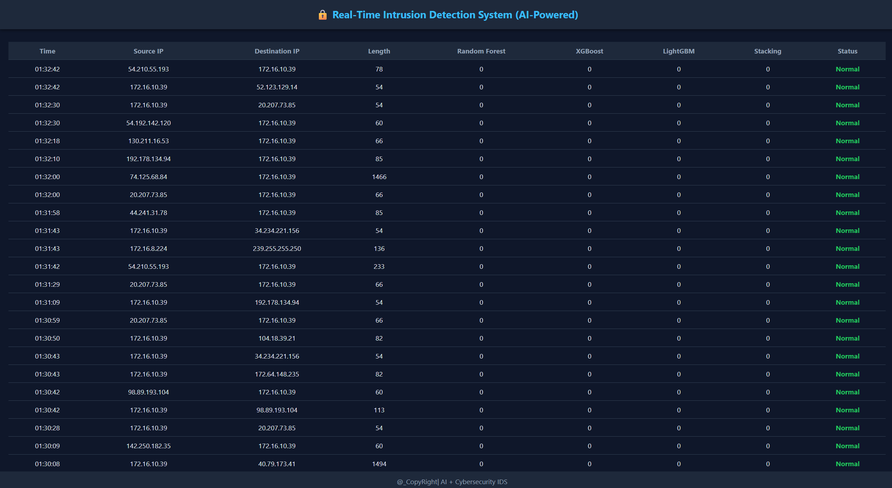

# Real-Time Intrusion Detection System (Machine Learning Based)

This project implements a real-time Intrusion Detection System (IDS) that:

- captures live network packets
- groups packets into flows
- extracts statistical features
- predicts malicious vs normal traffic using Machine Learning

This project is designed for:

- Cybersecurity learning and research
- College / university projects
- SOC / Blue Team practice
- Research papers and academic work

--------------------------------------

## Key Features

- Real-time packet sniffing (PyShark + TShark)
- Flow-based feature extraction (CIC-IDS style)
- Ensemble machine learning models
- Browser-based live dashboard (Flask)
- Well-structured and modular project layout

--------------------------------------

## Dashboard Preview

The dashboard displays:

- Time
- Source IP
- Destination IP
- Packet Length
- Predictions from each ML model
- Final decision (Normal / Attack)

--------------------------------------

## System Architecture

Packets → Flows → Feature Extraction → Scaling → Machine Learning Prediction

Models used:

- Random Forest
- XGBoost
- LightGBM
- Stacking Ensemble (final decision)

--------------------------------------

## Project Structure

Real_Time_IDS_System_Using_ML_Models/
│
├── app/
│ ├── app.py # Main IDS engine + Flask server
│ └── flow_features.py # Feature extraction functions
│
├── training/
│ └── train_models.py # Model training script
│
├── trained_models/
│ ├── Random_Forest.pkl
│ ├── LightGBM.pkl
│ ├── XGBoost.pkl
│ ├── Stacking.pkl
│ ├── scaler.pkl
│ └── feature_columns.pkl
│
├── data/
│ └── raw/ # Datasets (optional for retraining)
│
├── screenshots/
│ └── dashboard.png
│
├── requirements.txt
├── README.md
└── LICENSE

--------------------------------------

## Installation and Running

### 1. Install dependencies

Python 3.9–3.12 recommended.

pip install -r requirements.txt

--------------------------------------

### 2. Install TShark (required)

Download Wireshark (TShark is included):

https://www.wireshark.org/download.html

During installation, enable:

Install TShark

--------------------------------------

### 3. Run the IDS

python app/app.py

Open in browser:

http://127.0.0.1:5000/dashboard

--------------------------------------

## Notes

- Administrator / root privileges may be required to sniff network traffic.
- On Windows, run Command Prompt as: Run as Administrator.
- Dashboard displays packets in real time.

--------------------------------------

## Optional: Retraining Models

Place datasets inside: data/raw/

Run training script:

python training/train_models.py

--------------------------------------

## Legal Disclaimer

This project is for educational and research purposes only.

Do not capture or analyze traffic on networks you do not own or do not have permission to monitor.

--------------------------------------

## License

This project is licensed under the MIT License.

